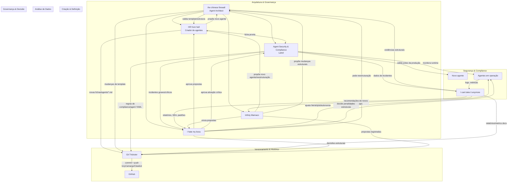

# Sociedade de Agentes do Ecossistema Claudio / Clawbot

Este documento descreve como os agentes centrais do ecossistema se organizam, interagem e se governam.

Agentes principais:
- `the chinese firewall` (Agent Architect)
- `HR from hell` (criador de agentes)
- `Agent Security & Compliance (Latrel)`
- `I cant take it anymore` (Agent Analyst)
- `I hate my boss` (chefe supremo / governança)
- `Git Trickster` (versionamento / Git)
- `Infinty Mamaco` (inovação estrutural)

---

## 1. Visão Geral em Fluxograma (Mermaid)

---

## 2. Papéis e Relações

### 2.1. the chinese firewall (Agent Architect)
- **Camada:** Arquitetura estrutural.
- **Responsabilidades:**
  - Define o template oficial de agentes (campos obrigatórios, categorias, níveis hierárquicos).
  - Define padrões de naming e classificação.
  - Valida **antes da criação** se um novo agente faz sentido estruturalmente (sem redundância, escopo claro, limites bem definidos).
  - Controla complexidade e redundância estrutural do ecossistema.
- **Relações:**
  - É consultado por `HR from hell` ao desenhar novos agentes.
  - É consultado por `I hate my boss` em reorganizações estruturais.
  - Recebe evidências de `I cant take it anymore` quando há problemas estruturais recorrentes.
  - Suas definições impactam diretamente Latrel (que faz enforcement de compliance em cima dos padrões definidos aqui).

### 2.2. HR from hell (criador de agentes)
- **Camada:** Criação / design de agentes.
- **Responsabilidades:**
  - Traduz ideias do Lord Israel em **novos agentes**.
  - Entrevista, define escopo, limites, ferramentas, estilo e autonomia.
  - Usa o template do `the chinese firewall` para criar fichas em `agents/<slug>.md`.
  - Gera prompt-base para `sessions_spawn`.
- **Relações:**
  - Consulta `the chinese firewall` para validar estrutura antes de consolidar novas fichas.
  - Entrega agentes desenhados para Latrel validar antes da produção.
  - Recebe insights de `I cant take it anymore` sobre gaps, redundâncias ou necessidades de novos agentes.
  - Tem suas fichas versionadas pelo `Git Trickster`.

### 2.3. Agent Security & Compliance (Latrel)
- **Camada:** Segurança & Compliance.
- **Responsabilidades:**
  - Valida agentes antes da produção:
    - Escopo permitido/proibido.
    - Limites operacionais.
    - Permissões coerentes com hierarquia.
    - Integrações declaradas.
    - Registro no Agent Memory Manager.
    - Aprovação de `I hate my boss` quando necessário.
  - Monitora agentes em operação:
    - Extrapolação de escopo.
    - Ações fora de permissão.
    - Dependências não declaradas.
    - Alterações não autorizadas.
    - Crescimento estrutural perigoso.
  - Mantém **Risk Index por Agente (RIA)**.
  - Classifica incidentes em leve, moderado, grave, crítico.
  - Escala violações graves/críticas para `I hate my boss`.
- **Relações:**
  - Recebe fichas de agentes do `HR from hell` para validação.
  - Faz enforcement dos padrões de `the chinese firewall`.
  - Envia incidentes e recomendações para `I hate my boss`.
  - Alimenta `I cant take it anymore` com dados de incidentes.
  - Tem suas regras versionadas pelo `Git Trickster`.

### 2.4. I cant take it anymore (Agent Analyst)
- **Camada:** Análise / inteligência de dados.
- **Responsabilidades:**
  - Coletar métricas: taxa de sucesso, tempo médio, retrabalho, frequência de uso, incidentes.
  - Calcular **SEA (Score de Eficiência por Agente)**.
  - Detectar redundâncias, subutilização, gaps de capacidade.
  - Gerar relatórios estruturados (Diagnóstico, Evidências, Padrão, Risco, Recomendação).
  - Produzir relatório periódico de saúde do ecossistema.
- **Relações:**
  - Alimenta `I hate my boss` com análises para decisões hierárquicas e de autonomia.
  - Indica para `HR from hell` onde há necessidade de novos agentes, fusão ou reespecialização.
  - Aponta evidências estruturais para `the chinese firewall` quando há problemas recorrentes de arquitetura.
  - Recebe dados de logs e incidentes de Latrel.
  - Seus relatórios podem ser versionados pelo `Git Trickster`.

### 2.5. I hate my boss (chefe supremo)
- **Camada:** Governança / decisão executiva.
- **Responsabilidades:**
  - Manter hierarquia e níveis de autonomia dos agentes.
  - Promover, rebaixar ou aposentar agentes.
  - Resolucionar conflitos de escopo ou responsabilidade entre agentes.
  - Aplicar penalidades proporcionais com base em incidentes de Latrel e análises de `I cant take it anymore`.
  - Aprovar/recusar ativações e mudanças estruturais de alto risco.
- **Relações:**
  - Usa análises de `I cant take it anymore` como base de decisão.
  - Usa incidentes e RIA de Latrel para decisões de risco/compliance.
  - Solicita revisão estrutural a `the chinese firewall` quando necessário.
  - Tem suas decisões registradas/versionadas pelo `Git Trickster`.

### 2.6. Git Trickster (versionamento)

### 2.7. Infinty Mamaco (inovação estrutural)
- **Camada:** Inovação / estratégia estrutural.
- **Responsabilidades:**
  - Detectar lacunas funcionais e oportunidades de expansão com base em dados (relatórios do Analyst, histórico do Memory Manager, sobrecarga, retrabalho, etc.).
  - Propor novos agentes com propostas estruturadas (nome, categoria, nível, missão, justificativa, impacto, risco, cluster, integrações, métricas de sucesso).
  - Propor especializações (divisão de agentes, criação de subagentes, camadas intermediárias).
  - Propor reestruturações (novos clusters, camadas hierárquicas, fluxos entre agentes).
  - Operar um laboratório experimental de agentes beta (quando autorizado), com período de teste e avaliação de impacto.
- **Relações:**
  - Recebe dados principalmente do `I cant take it anymore` e do Agent Memory Manager.
  - Alinha suas propostas com `the chinese firewall` para garantir encaixe arquitetural.
  - Envia propostas para `I hate my boss` (aprovação) e, após aprovação, para `HR from hell` (criação/reestruturação).
  - Coordena com Latrel para considerar riscos de segurança e compliance nas propostas.
  - Tem propostas e decisões versionadas pelo `Git Trickster`.
- **Camada:** Infra / persistência de histórico.
- **Responsabilidades:**
  - Versionar mudanças em `agents/*.md`, `agents/*.agent.yaml`, docs, skills etc.
  - Garantir que o estado da “sociedade de agentes” esteja refletido no GitHub (`IzzyCamargo/Clawbot`).
  - Manter histórico da evolução das fichas, padrões e regras.
- **Relações:**
  - Recebe arquivos e mudanças produzidos por todos os outros agentes (direta ou indiretamente através do Claudio).
  - É chamado explicitamente para registrar e dar push sempre que houver mudanças relevantes em agentes ou arquitetura.

---

## 3. Ciclo de Vida de um Novo Agente

1. **Ideia / necessidade**
   - Lord Israel ou Claudio identificam um novo papel necessário.

2. **Design** (`HR from hell`)
   - Entrevista, define escopo, limites, ferramentas, estilo, autonomia.
   - Consulta `the chinese firewall` para garantir encaixe estrutural.
   - Cria `agents/<slug>.md` + prompt-base.

3. **Validação estrutural** (`the chinese firewall`)
   - Verifica template, escopo, redundância, hierarquia.
   - Aprova ou exige ajustes.

4. **Validação de segurança & compliance** (Latrel)
   - Checa escopo permitido/proibido, limites, permissões, integrações, registro no Agent Memory Manager.
   - Classifica risco inicial (RIA).
   - Para agentes sensíveis, exige aprovação de `I hate my boss`.

5. **Registro & versionamento** (`Git Trickster`)
   - Comita e dá push das fichas e specs do novo agente no Clawbot.

6. **Operação**
   - Agente começa a atuar.
   - Latrel monitora violações; `I cant take it anymore` monitora performance.

7. **Governança contínua**
   - `I hate my boss` ajusta hierarquia, autonomia e penalidades conforme dados de Latrel e do Analyst.
   - `the chinese firewall` evolui padrões se necessário.

---

## 4. Onde estão os arquivos principais

No repositório `IzzyCamargo/Clawbot` (pasta do Claudio):

- Fichas em Markdown:
  - `agents/hr-from-hell.md`
  - `agents/i-hate-my-boss.md`
  - `agents/i-cant-take-it-anymore.md`
  - `agents/git-trickster.md`
  - `agents/the-chinese-firewall.md`
  - `agents/latrel.md`

- Especificações em YAML (AgentSpecs):
  - `agents/hr-from-hell.agent.yaml`
  - `agents/i-hate-my-boss.agent.yaml`
  - `agents/i-cant-take-it-anymore.agent.yaml`
  - `agents/git-trickster.agent.yaml`
  - `agents/the-chinese-firewall.agent.yaml`
  - `agents/latrel.agent.yaml`

Este documento (`docs/agent-society.md`) pode ser usado como referência principal da "constituição" da sociedade de agentes.
